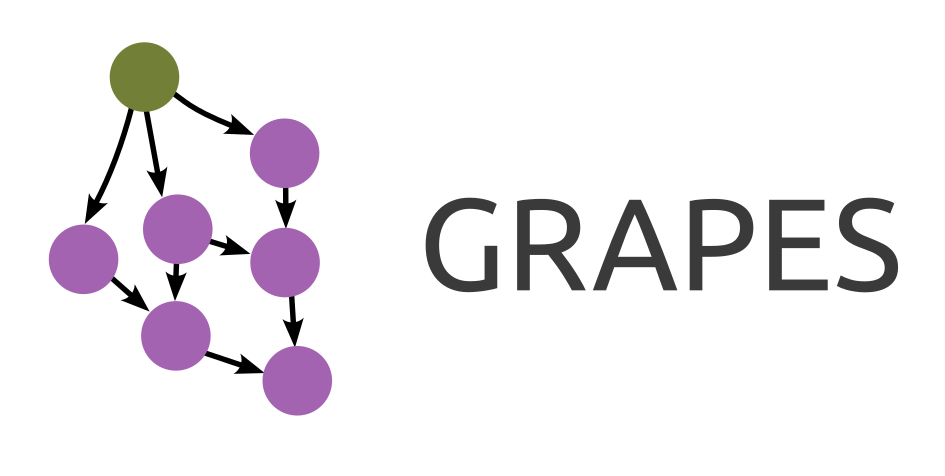

<div align="center">

</div>
<br>

This repository contains the official implementation of the graph sampling method presented in ["GRAPES: Learning to Sample Graphs for Scalable Graph Neural Networks"](https://arxiv.org/abs/2310.03399).

## Instructions

### 1. Install dependencies

Create a conda environment with the provided file, then activate it:

```sh
conda env create -f environment.yml
conda activate grapes
```

### 2. Train a model

Run the following to train a GCN classifier on the Cora dataset:

```sh
python main.py
```

Available datasets are `cora`, `citeseer`, and `pubmed` via the `--dataset` flag. For example,

```sh
python main.py --dataset=citeseer
```

When using a GPU, training on Cora should take less than 10 seconds.

### 3. Inspect results on W&B

Logging on Weights & Biases is enabled by default. Results will be logged to a project with name `gflow-sampling`.
To disable this, add the flag `--log_wandb=False`.

---

### Baselines and Data Analysis

For the baseline implementation anad data analysis, please check out the following repos:

* LADIES & FastGCN: https://anonymous.4open.science/r/LADIES-9589
* GAS: https://anonymous.4open.science/r/pyg_autoscale-2A4C
* AS-GCN: https://anonymous.4open.science/r/as-gcn-B0FA
* Data Analysis: https://anonymous.4open.science/r/GRAPES-plots-and-analyses-F4B6
